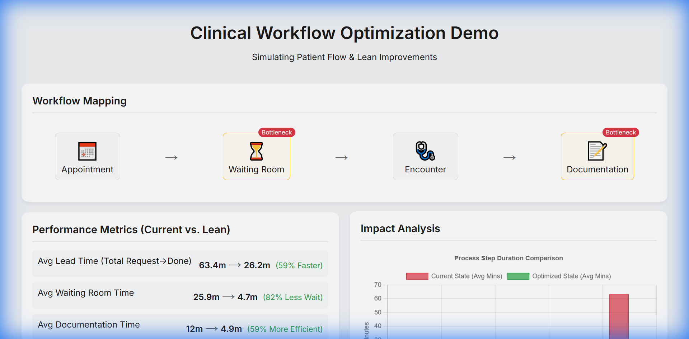
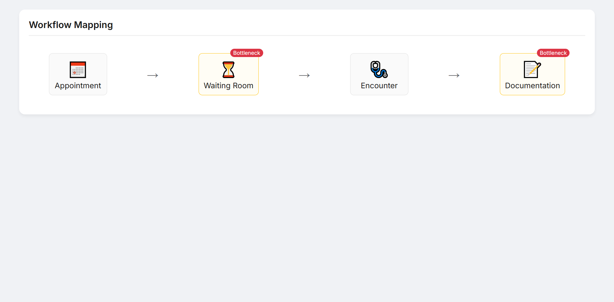
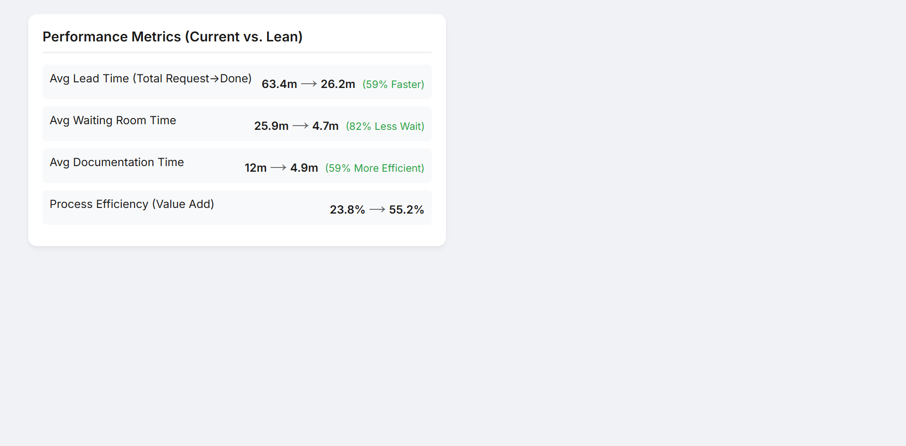
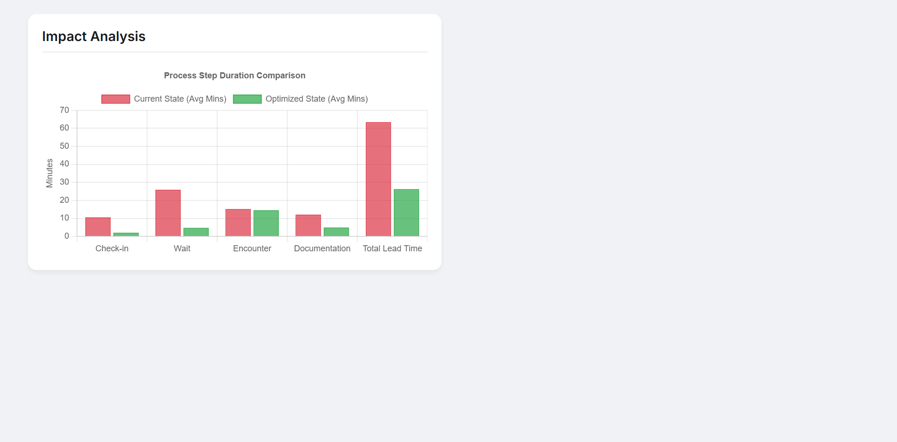

# Clinical Workflow Optimization Demo 🇨🇦

> **Data-driven simulation and optimization of clinical workflows**, demonstrating Lean Healthcare principles and OPOR-aligned patient processes.


---

## 🎯 Project Overview

This project simulates outpatient clinical workflows to:

- Identify operational bottlenecks (waiting room overflow, documentation backlog)  
- Optimize patient flow using Lean Healthcare principles  
- Provide interactive dashboards for data-driven decision-making  
- Model "Current State" vs "Future State" impacts on KPIs  

It’s designed to reflect real-world clinical operations while maintaining **full data confidentiality**.

---

## ✨ Key Features

- **Workflow Simulation**: Appointment → Check-in → Waiting → Encounter → Documentation  
- **Bottleneck Detection**: Queue analysis identifies high-wait areas  
- **Lean Optimization Modeling**: Evaluate impact of improvements like self-service kiosks, standardized templates, and patient flow enhancements  
- **Interactive Dashboard**: Real-time visualizations with Chart.js  

---

## 📸 Screenshots

### Clinical Workflow Dashboard


### Workflow Process & Bottleneck Identification


### Bottleneck Analysis (Current vs Future State)


### Optimized Workflow Impact


---

## 🛠 Skills Demonstrated

- **Clinical Workflow Analysis**: Patient journey mapping and pain-point identification  
- **Lean Healthcare & Process Improvement**: Waste reduction, standardization, and efficiency gains  
- **Full-Stack Development**: Node.js (Express) backend, modern JavaScript frontend  
- **Data Visualization**: Interactive charts for KPIs and process simulation  
- **User Acceptance Testing (UAT)**: Dashboard enables stakeholder validation of workflow changes  
- **OPOR Principles Awareness**: Designed to align with One Person, One Record patient workflows  

---

## 📊 Workflow Mapping

Simulation tracks timestamps for:

1. **Arrival** – Patient arrives at the clinic  
2. **Check-in** – Registration and administrative processes  
3. **Wait** – Time in waiting room (Non-Value Added)  
4. **Encounter** – Direct physician-patient interaction (Value Added)  
5. **Documentation** – Clinical notes and coding (Necessary Non-Value Added)  

---

## 🔧 Setup & Run

### Prerequisites

- Node.js 16+  
- npm package manager  

### Installation

```bash
git clone  https://github.com/myouseef/clinical-workflow-optimization-demo.git
cd clinical-workflow-optimization-demo
npm install
npm start

📝 Interpreting Results

Red Bars → Current State baseline with inefficiencies

Green Bars → Optimized State after Lean interventions

Bottlenecks → Highlighted in process map for attention

🔐 Privacy & Security

⚠️ This is a demo project using simulated data. In production:

Implement authentication & authorization

Encrypt data at rest & in transit

Comply with HIPAA/PHIPA standards

Use audit logging and role-based access

📄 License

This project is open-source under the MIT License.

✅ Final Notes

🔹 Senior-level portfolio ready for:

Nova Scotia Health

Ontario Health

Clinical Informatics Lead

Clinical Systems Analyst

🔹 Highlights: Lean workflow optimization, data-driven decision-making, OPOR-aligned patient processes

Built with ❤️ to demonstrate Clinical Workflow Optimization & Healthcare IT best practices


Note: All data in screenshots and demos is simulated for demonstration purposes. This system is designed for healthcare environments and includes features to ensure HIPAA compliance and data security.

Version: 2.0.0 Last Updated: January 2026 Author: Mohamed Mahmoud Youssef
